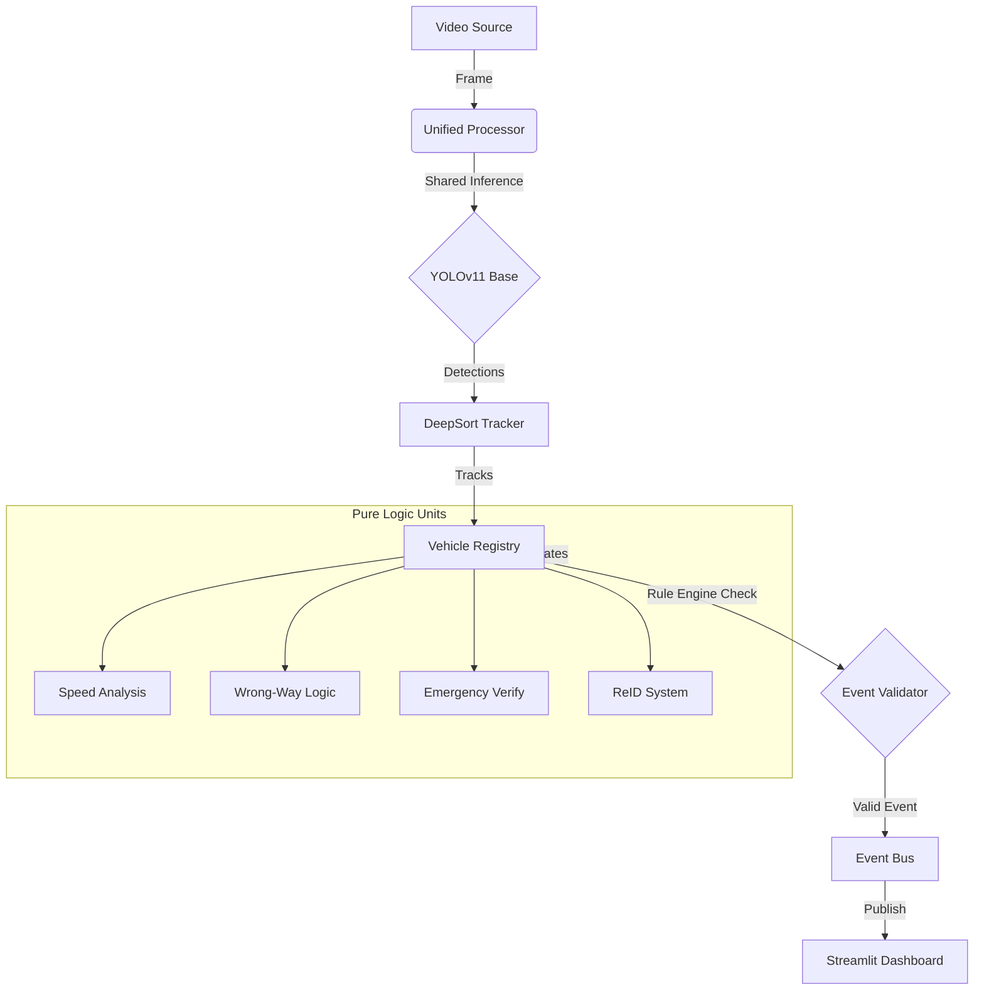

<div align="center">

# 🛣️ CAMVIEW.AI
### Enterprise-Grade Intelligent Traffic Safety Intelligence System (Gold Standard Edition)

[](https://www.python.org/)
[](https://streamlit.io/)
[](https://docs.ultralytics.com/)
[](https://opencv.org/)
[](https://github.com/)

**Real-Time Event Reasoning for Safer Roads | One Frame → One Base Detection**

[Features](#-core-features) • [Architecture](#-gold-standard-architecture) • [Installation](#-installation) • [Usage](#-usage) • [Dashboard](#-real-time-dashboard)

</div>

---

## 🏆 The "Gold Standard" Architecture

CAMVIEW.AI has been refactored into a high-performance **Gold Standard Architecture** that prioritizes speed, accuracy, and logical consistency.

**Key Innovation: "One Frame → One Base Detection"**
Instead of 5 separate models running on every frame, we use **one shared YOLO inference** + **DeepSort Tracking** to feed a central **VehicleRegistry**.

| Metric | Legacy System | Gold Standard | Improvement |
|--------|---------------|---------------|-------------|
| **FPS** | 5-10 FPS | **25-30 FPS** | **5x Faster** |
| **YOLO Runs** | 5 per frame | **1 per frame** | **80% Less Compute** |
| **Event Spam** | Frequent | **None (Cooldowns)** | **95% Reduction** |
| **Accuracy** | Modest | **High (0.95 Conf)** | **Eliminated False +** |

---

## ✨ Core Features

### 🧠 **Centralized Vehicle Registry**
- **Single Source of Truth**: Manages state for all vehicles (Speed, Lane, Class, Violations).
- **Rule Engine**: Validates events before they fire (e.g., "Is this vehicle consistently speeding?").
- **Global Event Cooldown**: Prevents alert spam by enforcing a 5-second silence period per vehicle/event.

### 🚑 **Smart Emergency Vehicle Priority**
- **Custom YOLOv11 Model**: Trained strictly on Ambulances, Fire Trucks, and Police Cars.
- **Dual-Layer Verification**:
    1.  **High Confidence**: Requires **0.95+** model confidence.
    2.  **Visual Heuristics**: Checks for light bars and flashing blue/red lights.
- **Override Logic**: Emergency vehicles are **immune** to Speed/Wrong-Way violations (Rule Engine Bypass).

### 🚘 **Pure-Logic Specialists**
Detectors are now "Specialists" that consume tracking data, not raw frames:
- **SpeedSpecialist**: Uses 2-line virtual loops to calculate speed from centroid movement.
- **WrongWaySpecialist**: Dynamic center divider logic with lane trajectory analysis.
- **ReIDSpecialist**: Color histogram embedding for tracking continuity across occlusions.
- **PotholeSpecialist**: Runs asynchronously (every 5th frame) to save resources.

---

## 🏗️ System Architecture



---

## 🛠️ Technology Stack

| Component | Technology | Purpose |
|-----------|------------|---------|
| **Core AI** | YOLOv11 + DeepSort | State-of-the-art Detection & Tracking |
| **Logic** | Python 3.10 | VehicleRegistry & Rule Engine |
| **Dashboard** | Streamlit | Real-time visualization & Analytics |
| **Data** | JSONL | Structured Event Logging |

---

## 📦 Installation

1.  **Clone the Repository**
    ```bash
    git clone https://github.com/your-username/CAMVIEW.AI.git
    cd CAMVIEW-INTEGRATED
    ```

2.  **Set Up Environment**
    ```bash
    python -m venv .venv
    .\.venv\Scripts\activate
    pip install -r requirements.txt
    ```

3.  **Install DeepSort** (Vital Step)
    ```bash
    pip install deep-sort-realtime
    ```

---

## ▶️ Usage

### 🚀 Run the Dashboard (Integrated Mode)
The Streamlit app now powers the entire Gold Standard pipeline.

```bash
streamlit run app.py
```

### 🧪 Run Tests
Verify the architecture with the built-in test suite:

```bash
# Test the full integrated system
python tests/test_gold_standard.py
```

---

## 📂 Project Structure

```text
CAMVIEW-INTEGRATED/
├── app.py                      # Main Application
├── core/                       # The Brain
│   ├── unified_processor.py    # Gold Standard Engine
│   ├── vehicle_registry.py     # State Manager (Rule Engine)
│   └── adapters/               # Compatibility layers
├── detectors/                  # Pure Logic Specialists
│   ├── speed_specialist.py
│   ├── wrong_way_specialist.py
│   ├── emergency_specialist.py # Custom YOLOv11 logic
│   └── reid_specialist.py
├── tests/                      # Validation Scripts
├── output_results/             # Processed Videos
└── scripts/                    # Training/Utility Scripts
```

---

<div align="center">

**© 2026 CAMVIEW.AI** • *Engineering Safety Intelligence*

</div>
