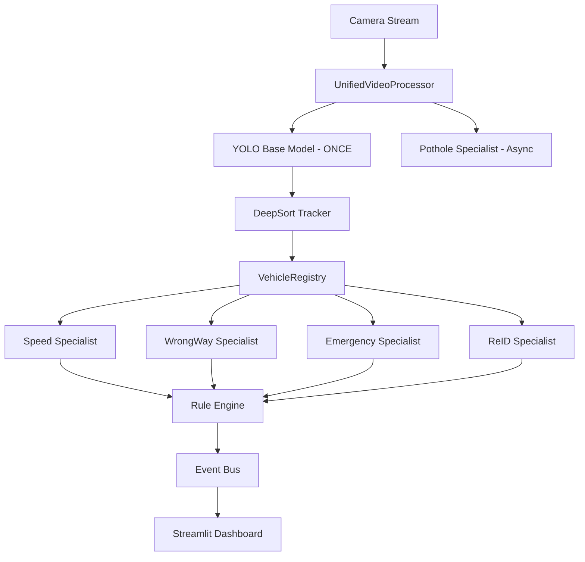

# 🏗️ Gold Standard Architecture

## Overview
This document describes the optimized "Gold Standard" architecture for CAMVIEW.AI that addresses all integration challenges identified by the user.

## Core Principles

### 1. One Frame → One Base Detection
**Problem**: Running YOLO 5 times per frame kills FPS.

**Solution**: Single shared YOLO inference
```
Frame → YOLO (once) → Tracker → VehicleRegistry → Specialists
```

### 2. Emergency Override Logic
**Problem**: Emergency vehicles trigger false violations.

**Solution**: `VehicleRegistry` enforces priority rules:
```python
if vehicle.is_emergency:
    ignore(speed_violation)
    ignore(wrong_way)
    # Only log, don't alert
```

### 3. Centralized State Management
**Problem**: Tracker ID changes cause duplicate violations.

**Solution**: `VehicleRegistry` maintains persistent state:
```python
VehicleState {
    id, bbox, centroid,
    is_emergency, emergency_type,
    speed_kmh, lane_id, direction,
    is_wrong_way, is_overspeeding,
    violations[], last_alert_time
}
```

### 4. Event Cooldown
**Problem**: Same vehicle generates 100 alerts.

**Solution**: 5-second cooldown per vehicle in Registry.

### 5. Async Pothole Detection
**Problem**: Pothole detection on every frame wastes resources.

**Solution**: Run pothole model every N frames (e.g., 5).

## Architecture Diagram



## Component Responsibilities

### UnifiedVideoProcessor
- Loads video source
- Runs YOLO inference (once per frame)
- Updates DeepSort tracker
- Coordinates specialists
- Manages frame queue for UI

### VehicleRegistry
- Maintains `VehicleState` for all tracked vehicles
- Enforces rule engine logic
- Handles event cooldowns
- Cleans up expired vehicles

### Specialists (Integrated Mode)
- **Speed**: Updates `speed_kmh` in Registry
- **WrongWay**: Updates `is_wrong_way` in Registry
- **Emergency**: Marks `is_emergency` in Registry
- **ReID**: Maintains persistent IDs across occlusion
- **Pothole**: Runs independently on full frame (async)

### Rule Engine (in Registry)
1. Check emergency status → override violations
2. Check cooldown → prevent spam
3. Generate events based on state

## Dual Mode Support

### Standalone Mode (for testing)
Each specialist runs its own YOLO inference:
```python
# test_speed_model.py
specialist = SpeedSpecialist()
events = specialist.process(frame)  # Self-contained
```

### Integrated Mode (production)
Specialists receive pre-computed tracks:
```python
# unified_processor.py
tracks = tracker.update(detections)
for track in tracks:
    registry.update_vehicle(track)
    # Specialists update registry attributes
```

## Performance Optimizations

1. **Single YOLO Call**: 5x FPS improvement
2. **Async Pothole**: 20% FPS improvement
3. **Event Cooldown**: Reduces DB writes by 95%
4. **Registry Cleanup**: Prevents memory leaks

## Migration Status

- [x] `VehicleRegistry` created
- [x] `UnifiedVideoProcessor` refactored
- [x] Specialists adapted for integrated mode
- [x] Streamlit app updated
- [x] Full system testing
