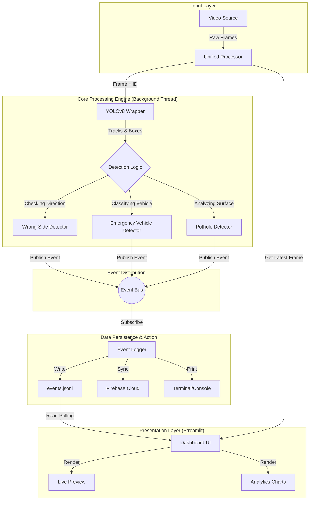
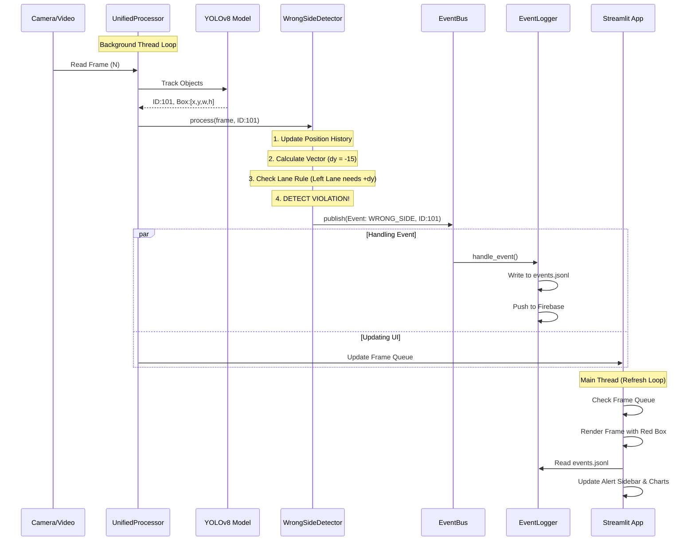
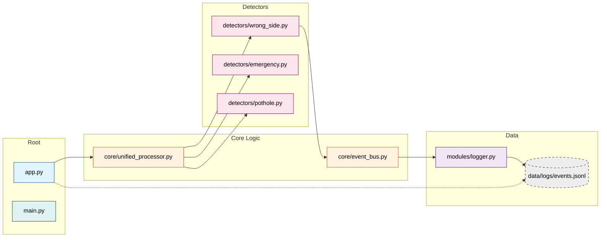

# 🌊 CAMVIEW.AI - System Architecture & Data Flow

This document outlines the end-to-end data flow of the CAMVIEW.AI system, detailing how video frames are transformed into actionable safety intelligence.

## 1. High-Level System Architecture

The system operates on a **Producer-Consumer** model decoupled by an **Event Bus**.

---

## 2. Component Interaction Breakdown

### A. The Core Engine (`core/`)
The `UnifiedVideoProcessor` is the heart of the system.
*   **Threading**: Runs in a separate `threading.Thread` to prevent blocking the UI.
*   **Responsibility**:
    1.  Captures frame from OpenCV.
    2.  Passes frame to all Detectors sequentially.
    3.  Updates the shared `ProcessingStatus` (FPS, Frame Count).
    4.  Pushes the annotated frame to a `queue.Queue` for the UI to consume.

### B. The Detectors (`detectors/`)
Independent modules that implement specific safety rules.
*   **Wrong-Side Detector**:
    *   *Input*: Track IDs & Bounding Boxes.
    *   *State*: Keeps a history buffer of past positions `[(x1,y1), (x2,y2)...]`.
    *   *Logic*: Calculates vector `(dx, dy)`. If `dy` opposes the lane direction -> **VIOLATION**.
*   **Emergency Detector**:
    *   *Input*: Class IDs.
    *   *Logic*: Checks for high-confidence `ambulance`/`fire truck`. Enforces Cooldown (10s) to avoid spam.
*   **Pothole Detector**:
    *   *Input*: Object Detection.
    *   *Logic*: Measures Bounding Box Area -> Determines Severity (Low/Med/High).

### C. The Event Bus (`core/event_bus.py`)
A lightweight Pub/Sub (Observer Pattern) implementation.
*   **Decoupling**: Detectors don't know about the Logger. Key for scalability.
*   **Events**: Standardized data objects (`event_type`, `severity`, `metadata`, `timestamp`).

---

## 3. Detailed Data Sequence (Wrong-Side Driving Example)

This sequence diagram illustrates exactly what happens when a vehicle drives on the wrong side.

---

## 4. Folder Structure Map

Understanding where the code lives for each part of the flow.

## 5. Technology Stack Flow

| Stage | Tech Stack | Role |
| :--- | :--- | :--- |
| **Ingestion** | **OpenCV (`cv2`)** | High-performance frame grabbing and pre-processing (resizing/color conversion). |
| **Inference** | **Ultralytics YOLOv8** | PyTorch-based Deep Learning for object detection and object tracking (BoT-SORT/ByteTrack). |
| **Logic** | **Python 3.10+** | NumPy for vector math, threading for concurrency. |
| **Visualization**| **Streamlit** | React-based reactive UI framework for Python. |
| **Analytics** | **Pandas & Plotly** | Data aggregation and interactive HTML5 charting. |
