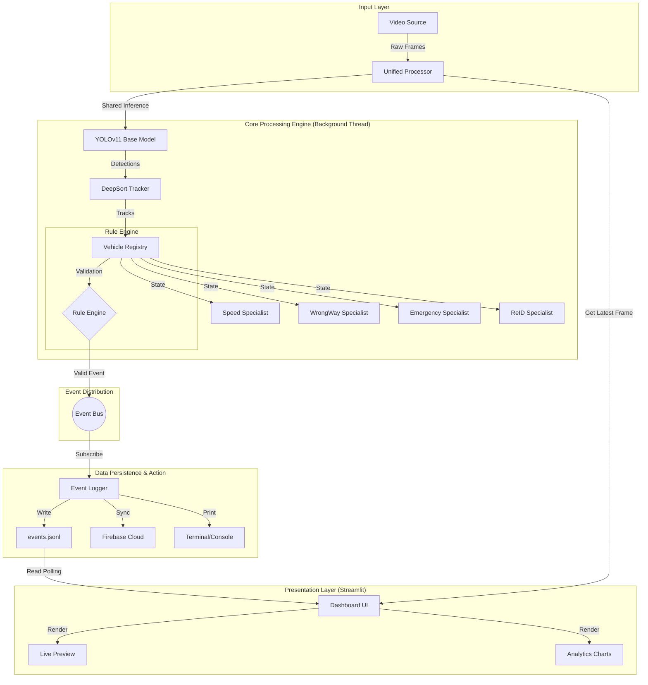
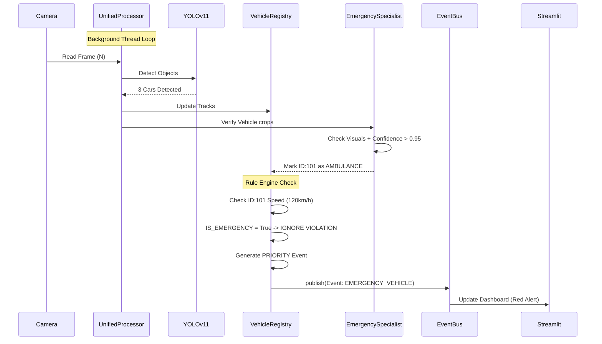
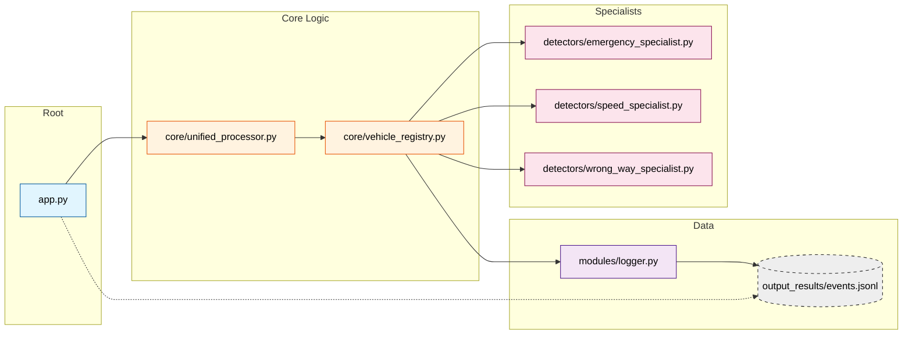

<div align="center">

# 🌊 CAMVIEW.AI - System Architecture & Data Flow
### Enterprise-Grade Intelligent Traffic Safety Intelligence System (Gold Standard Edition)

[](https://www.python.org/)
[](https://streamlit.io/)
[](https://docs.ultralytics.com/)
[](https://opencv.org/)
[](https://github.com/)

**Real-Time Event Reasoning for Safer Roads | One Frame → One Base Detection**

[Features](#-core-features) • [Architecture](#1-high-level-system-architecture) • [Installation](#-installation) • [Usage](#-usage) • [Dashboard](#-real-time-dashboard)

</div>

---

## 1. High-Level System Architecture

The Gold Standard architecture operates on a **Single-Scan Producer-Consumer** model coupled with a **Centralized Registry**.



---

## 2. Component Interaction Breakdown

### A. The Core Engine (`core/`)
The `UnifiedVideoProcessor` is the heart of the system.
*   **Threading**: Runs in a separate `threading.Thread` to prevent blocking the UI.
*   **Responsibility**:
    1.  Captures frame from OpenCV.
    2.  Runs **ONE** YOLO inference per frame (Efficiency).
    3.  Updates the `VehicleRegistry` with new track data.
    4.  Pushes the annotated frame to a `queue.Queue` for the UI.

### B. The Vehicle Registry (`core/vehicle_registry.py`)
The "Brain" that maintains persistent state for every vehicle.
*   **Responsibility**:
    *   Tracks Speed, Lane, Class, and Violation history.
    *   **Rule Engine**: Validates events (e.g., "Is this vehicle exempt?").
    *   **Cooldowns**: Enforces 5-second silence period to prevent spam.

### C. The Specialists (`detectors/`)
Pure logic units that consume data from the Registry.
*   **Emergency Specialist**:
    *   *Input*: Vehicle Crops.
    *   *Logic*: Custom YOLOv11 + Visual Logic (Blue/Red Lights). **95% Confidence Required**.
    *   *Effect*: Marks vehicle as `is_emergency`, bypassing all violations.
*   **Wrong-Way Specialist**:
    *   *Input*: Track Trajectories.
    *   *Logic*: Dynamic vector analysis relative to center divider.
*   **Speed Specialist**:
    *   *Input*: Centroid movement.
    *   *Logic*: 2-Line Virtual Loop calculation.

---

## 3. Detailed Data Sequence (Emergency Override Example)

This sequence diagram illustrates how the system prioritizes emergency vehicles.



---

## 4. Folder Structure Map

Understanding where the code lives for each part of the flow.



---

## 5. Technology Stack Flow

| Stage | Tech Stack | Role |
| :--- | :--- | :--- |
| **Ingestion** | **OpenCV (`cv2`)** | High-performance frame grabbing. |
| **Inference** | **YOLOv11 + DeepSort** | Single-shot detection with robust multi-object tracking. |
| **Logic** | **Python 3.10** | `VehicleRegistry` state machine and Rule Engine. |
| **Visualization**| **Streamlit** | React-based reactive UI framework. |
| **Analytics** | **Pandas & Plotly** | Data aggregation and interactive HTML5 charting. |

---

## 6. Installation & Usage

### Installation
```bash
git clone https://github.com/your-username/CAMVIEW.AI.git
cd CAMVIEW-INTEGRATED
python -m venv .venv
.\.venv\Scripts\activate
pip install -r requirements.txt
pip install deep-sort-realtime
```

### ▶️ Run Dashboard
```bash
streamlit run app.py
```

### Notion file
```bash
https://flash-helmet-d0e.notion.site/CAMVIEW-AI-Enterprise-Traffic-Intelligence-Platform-2eb3e53d4a2c800787bdcfcd2d451c0e
```

<div align="center">

**© 2026 CAMVIEW.AI** • *Engineering Safety Intelligence by TEAM Unkown Coders*

</div>
